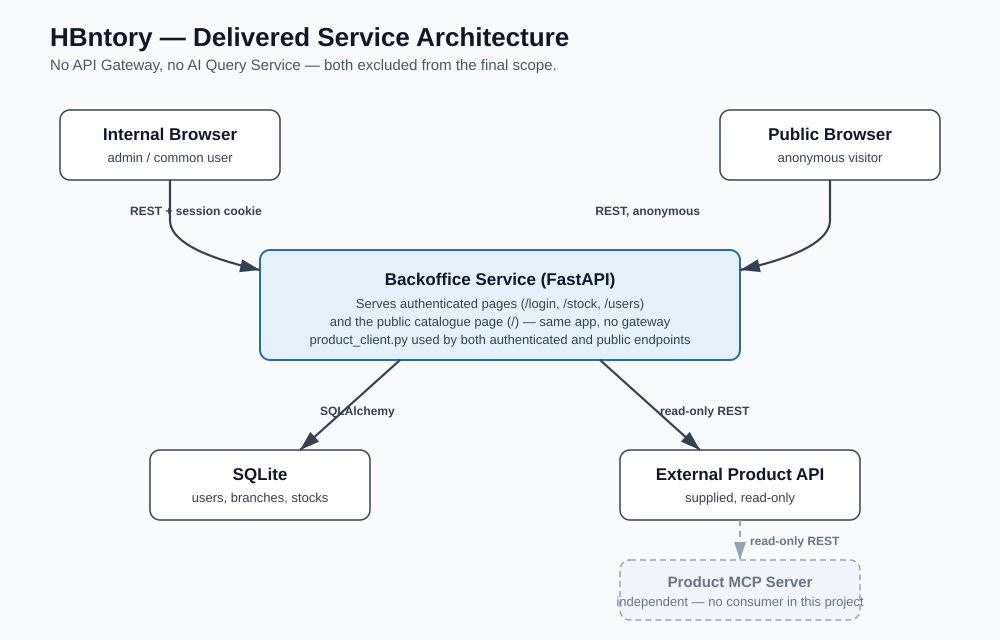

# HBntory — Initial Service Diagram

## Connections

| Source | Destination | Communication |
| --- | --- | --- |
| Internal browser | Backoffice Service | REST with signed session cookie |
| Backoffice Service | PostgreSQL | SQLAlchemy |
| Backoffice Service | External Product API | Read-only REST |
| Public browser | Public Client Service | REST, not WebSockets |
| Public Client Service | Product MCP Server | MCP over Streamable HTTP |
| Product MCP Server | External Product API | Read-only REST |
| Public Client Service | PostgreSQL | Controlled, read-only SQLAlchemy queries |
| Public browser | AI Query Service (final phase) | REST |
| AI Query Service | Product MCP Server (final phase) | MCP over Streamable HTTP |
| AI Query Service | PostgreSQL (final phase) | Controlled, read-only SQLAlchemy queries |

The Product API is the authority for product information. PostgreSQL stores users, branches, external product IDs and stock quantities. The Product MCP Server and public Client Web Interface are part of the foundation. The AI agents and AI Query Service are planned as the final phase, built last once the foundation is stable — deferred, not excluded. When that phase lands, the Client Web Interface sends questions to the AI Query Service, which reaches product data through the MCP server and stock through controlled, read-only queries.
